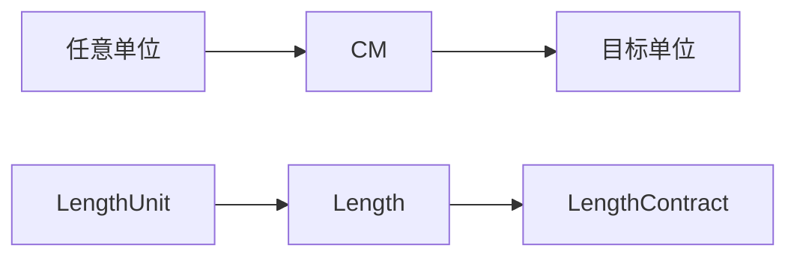

# 长度转换模块

提供厘米和英寸之间的相互转换功能。

## 结构



## 使用方法

```php
use Roog\Kmc\Lib\Converse\LengthUnit\Length;
use Roog\Kmc\Lib\Converse\LengthUnit\LengthUnit;

$length = new Length(10, LengthUnit::INCH);
echo $length->getNumber(LengthUnit::CM);  // 25.4
```

使用简单直观。如需添加新的长度单位，请修改 `LengthUnit` 枚举类。
