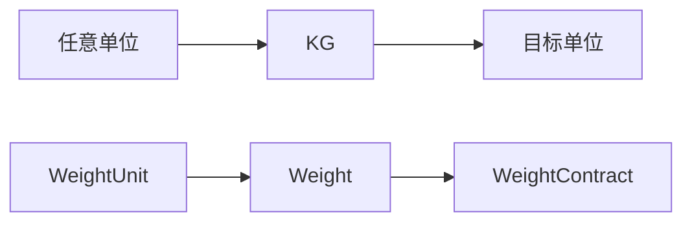

# 重量转换模块

提供公斤和磅之间的相互转换功能。

## 结构



## 使用方法

```php
use Roog\Kmc\Lib\Converse\WeightUnit\Weight;
use Roog\Kmc\Lib\Converse\WeightUnit\WeightUnit;

$weight = new Weight(10, WeightUnit::POUND);
echo $weight->getNumber(WeightUnit::KG);  // 4.5359237
```

使用简单直观。如需添加新的重量单位，请修改 `WeightUnit` 枚举类。