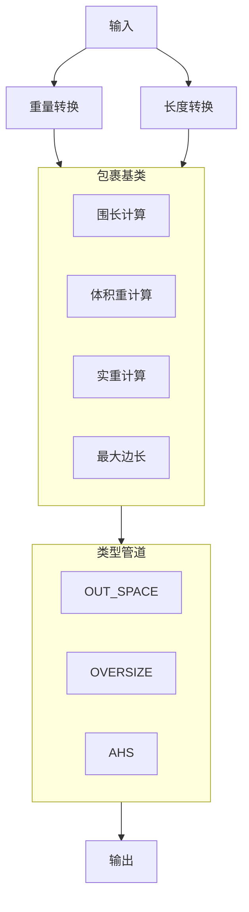

## 基础设计

### 1. 实现长度/重量转换

    长度转换理论上应该在输入后的第一时间处理。单独进行封装，避免不该存在的耦合性耽误拓展能力。

### 2. 实现包裹类

    包裹类是数据模型。
    包裹类封装了长度/重量转换，包裹类中定义了长度/重量转换后的结果，以及包裹类中定义了包裹信息。

### 3. 实现类型管道

    类型管道是完成需求的核心，根据优先级顺序封装PipeLine,依次处理并输出结果。

### 4. 流程图

